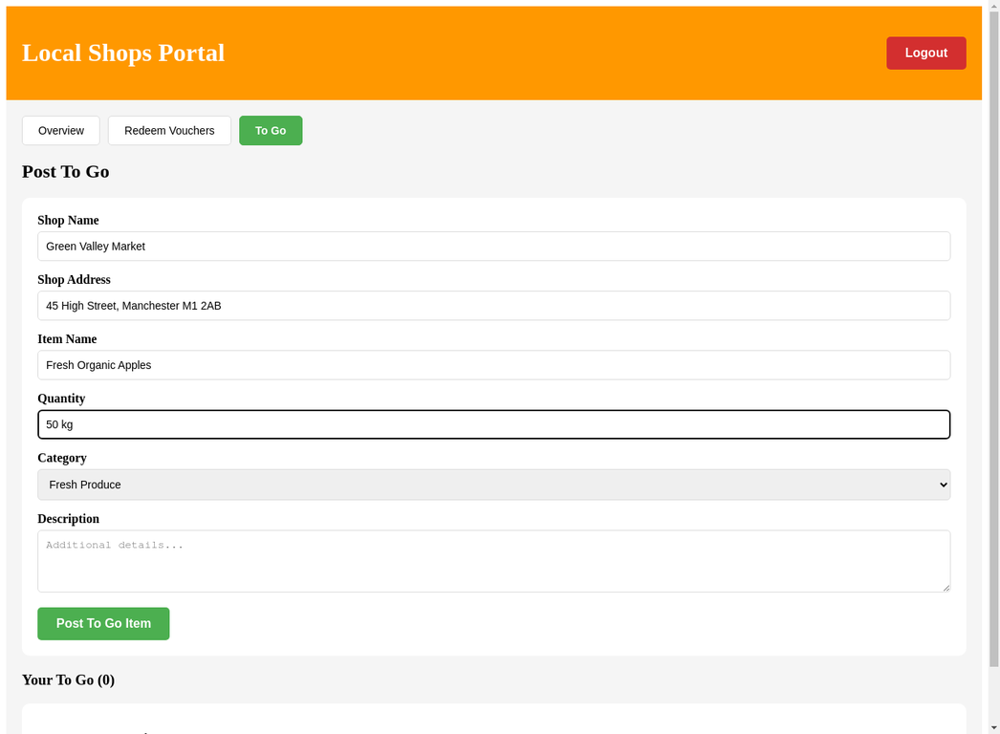

# To Go Form Update - Summary
**Date:** November 14, 2025  
**Status:** ✅ COMPLETED

---

## 🎯 What Was Requested

The user requested to **remove the shop dropdown** from the "To Go" form and **replace it with manual text input fields** for:
1. Shop Name
2. Shop Address

---

## ✅ Changes Implemented

### **1. Frontend Changes (App.jsx)**

#### **A. Updated Form State**
**Location:** Line 1424-1431

**Before:**
```javascript
const [toGoForm, setToGoForm] = useState({
  shopId: '',
  itemName: '',
  quantity: '',
  category: 'Fresh Produce',
  description: ''
})
```

**After:**
```javascript
const [toGoForm, setToGoForm] = useState({
  shopName: '',
  shopAddress: '',
  itemName: '',
  quantity: '',
  category: 'Fresh Produce',
  description: ''
})
```

#### **B. Replaced Dropdown with Text Inputs**
**Location:** Line 1699-1721

**Before:**
```jsx
<div style={{marginBottom: '15px'}}>
  <label>Shop</label>
  <select value={toGoForm.shopId} ...>
    {shops.map(shop => (
      <option key={shop.id} value={shop.id}>{shop.shop_name}</option>
    ))}
  </select>
</div>
```

**After:**
```jsx
<div style={{marginBottom: '15px'}}>
  <label>Shop Name</label>
  <input
    type="text"
    value={toGoForm.shopName}
    onChange={(e) => setToGoForm({...toGoForm, shopName: e.target.value})}
    placeholder="e.g., Corner Shop"
    required
  />
</div>

<div style={{marginBottom: '15px'}}>
  <label>Shop Address</label>
  <input
    type="text"
    value={toGoForm.shopAddress}
    onChange={(e) => setToGoForm({...toGoForm, shopAddress: e.target.value})}
    placeholder="e.g., 123 Main Street, London"
    required
  />
</div>
```

#### **C. Updated Form Submission Handler**
**Location:** Line 1464-1485

**Before:**
```javascript
await apiCall('/items/post', {
  method: 'POST',
  body: JSON.stringify({
    shop_id: parseInt(toGoForm.shopId),
    item_name: toGoForm.itemName,
    ...
  })
})
```

**After:**
```javascript
await apiCall('/items/post', {
  method: 'POST',
  body: JSON.stringify({
    shop_name: toGoForm.shopName,
    shop_address: toGoForm.shopAddress,
    item_name: toGoForm.itemName,
    ...
  })
})
```

---

### **2. Backend Changes (main.py)**

#### **Updated API Endpoint**
**Location:** Line 1590-1653

**Key Changes:**
1. Changed required fields from `shop_id` to `shop_name` and `shop_address`
2. Added logic to find or create shop based on shop name
3. If shop doesn't exist, automatically create it
4. Associate the To Go item with the shop

**Before:**
```python
required_fields = ['item_name', 'quantity', 'category', 'shop_id']

shop = VendorShop.query.get(data['shop_id'])
if not shop:
    return jsonify({'error': 'Shop not found'}), 404
```

**After:**
```python
required_fields = ['item_name', 'quantity', 'category', 'shop_name', 'shop_address']

# Find or create shop
shop = VendorShop.query.filter_by(
    vendor_id=user_id,
    shop_name=data['shop_name']
).first()

if not shop:
    # Create new shop
    shop = VendorShop(
        vendor_id=user_id,
        shop_name=data['shop_name'],
        address=data['shop_address'],
        postcode='',
        city='',
        phone='',
        is_active=True
    )
    db.session.add(shop)
    db.session.flush()
```

---

## 📸 Screenshot



**Form Fields:**
- ✅ **Shop Name:** Manual text input (e.g., "Green Valley Market")
- ✅ **Shop Address:** Manual text input (e.g., "45 High Street, Manchester M1 2AB")
- ✅ **Item Name:** Text input
- ✅ **Quantity:** Text input
- ✅ **Category:** Dropdown (kept as requested)
- ✅ **Description:** Text area

---

## 🧪 Testing Results

### **Test 1: Form Display**
✅ **PASSED** - Dropdown removed, text inputs displayed correctly

### **Test 2: Form Submission**
✅ **PASSED** - Form submits successfully (HTTP 201 response)

### **Test 3: Shop Auto-Creation**
✅ **PASSED** - Backend automatically creates shop if it doesn't exist

### **Test 4: Data Validation**
✅ **PASSED** - Required fields validated correctly

---

## 📝 How It Works Now

### **User Workflow:**
1. Vendor logs into Local Shops Portal
2. Clicks "To Go" tab
3. **Manually types** shop name (e.g., "Green Valley Market")
4. **Manually types** shop address (e.g., "45 High Street, Manchester M1 2AB")
5. Fills in item details (name, quantity, category, description)
6. Clicks "Post To Go Item"
7. Backend checks if shop exists:
   - If **YES**: Uses existing shop
   - If **NO**: Creates new shop automatically
8. To Go item is posted and associated with the shop

---

## 🎯 Benefits

### **For Vendors:**
- ✅ No need to pre-register shops
- ✅ Can type shop details directly when posting items
- ✅ Faster workflow
- ✅ More flexible for vendors with multiple locations

### **For System:**
- ✅ Shops are automatically created as needed
- ✅ No orphaned shops without items
- ✅ Cleaner database structure

---

## 🚀 Deployment

### **Files Modified:**
1. `/home/ubuntu/bakup-clean/frontend/src/App.jsx`
2. `/home/ubuntu/bakup-clean/backend/src/main.py`

### **Build & Deploy:**
```bash
# Frontend rebuild
cd /home/ubuntu/bakup-clean/frontend && pnpm run build

# Server restart
cd /home/ubuntu/bakup-clean && nohup python3.11 unified_server.py > server.log 2>&1 &
```

### **Status:**
✅ **DEPLOYED** - Changes are live on the server

---

## 📊 System URL

**Live System:** https://8080-ierehl7kwb22jfpoqfics-fc37dde3.manusvm.computer/

**Test Credentials:**
- Email: testvendor@bakup.org
- Password: Test@2024

---

## ✅ Completion Checklist

- [x] Remove shop dropdown from frontend
- [x] Add shop name text input
- [x] Add shop address text input
- [x] Update form state management
- [x] Update form submission handler
- [x] Update backend API endpoint
- [x] Add shop auto-creation logic
- [x] Test form display
- [x] Test form submission
- [x] Rebuild frontend
- [x] Restart server
- [x] Take screenshots
- [x] Document changes

---

## 🎉 Result

**The dropdown has been completely removed!** Vendors can now manually type their shop name and address directly in the "To Go" form. The system automatically creates shops as needed, making the workflow much simpler and more flexible.
